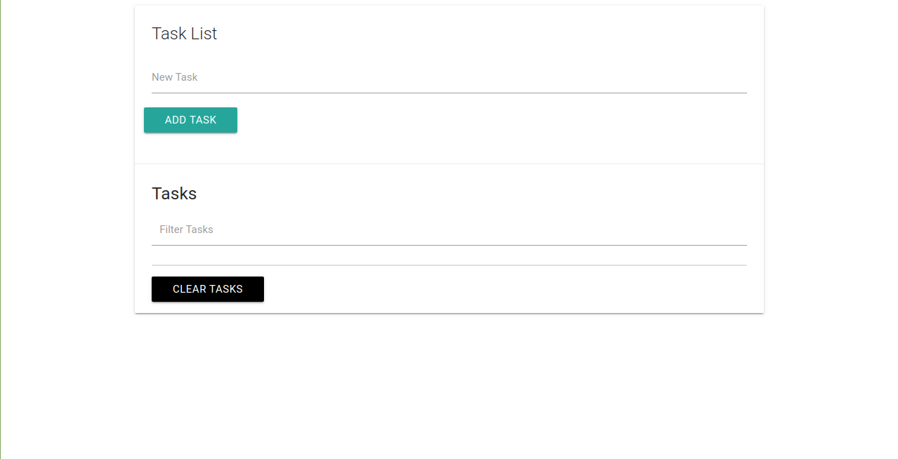

<h1 align="center">Task List</h1>

A task list built with JavaScript

## Table of Contents
* [Project Status](#project-status)
* [Features](#features)
* [Screenshots](#screenshots)
* [Technologies](#technologies)
* [Inspirations](#inspirations)
* [Contact](#contact)
* [License](#license)

## Project Status
This project is currently: _In Progress_

## Features
Complete:
* Users can add and remove tasks
* Tasks persist to local storage
* Users can filter tasks

To-Do List:
* Users can edit a task
* Users can mark a task as completed
* Users can view a list of all completed tasks
* Users can see the date when they created the task

## Screenshots

## Technologies
Built with:
* HTML
* CSS
* JavaScript

## Inspirations
This project was built as part of Brad Traversy's Udemy course, [Modern JavaScript from the Beginning](https://www.udemy.com/modern-javascript-from-the-beginning/).

## Contact
Twitter - [@CBStanley12](https://twitter.com/CBStanley12)

DEV - [cbstanley12](https://dev.to/cbstanley12)

## License
**MIT License**: 
A short and simple permissive license with conditions only requiring preservation of copyright and license notices. Licensed works, modifications, and larger works may be distributed under different terms and without source code.